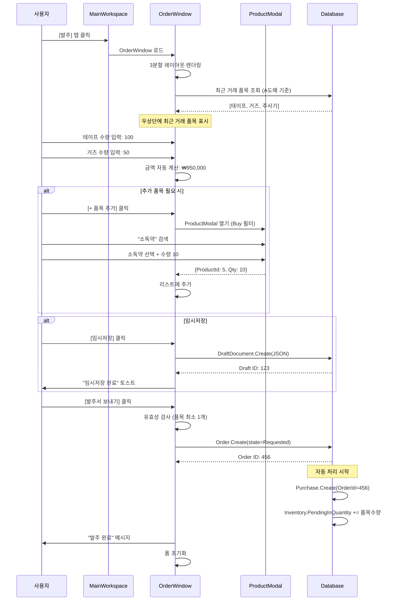
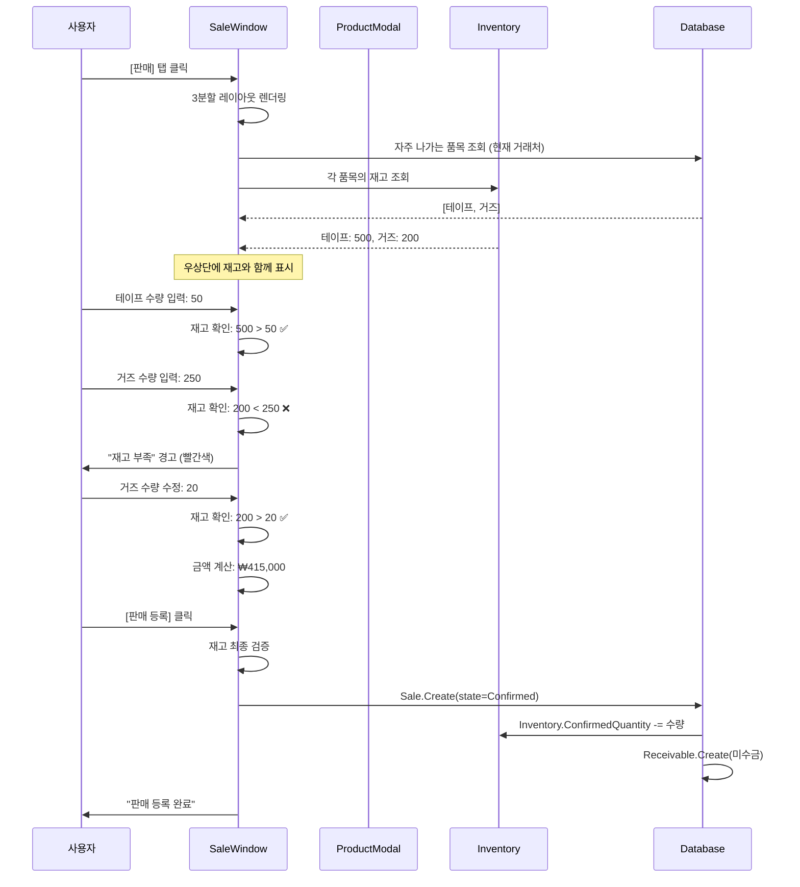
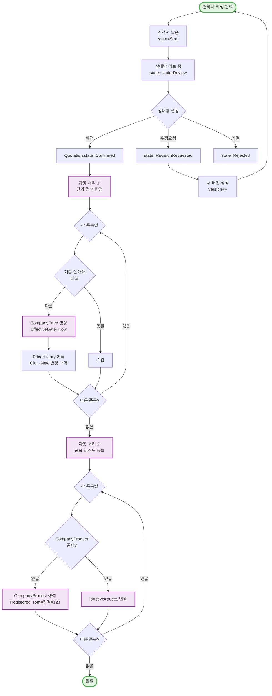

# 사용자 여정 플로우 (User Journey Flow)

> **작성일**: 2026-01-26
> **목적**: Phase 1 핵심 사용자 시나리오 시각화

---

## 🎯 전체 사용자 여정 (Happy Path)

```mermaid
graph TD
    Start([앱 시작]) --> CompanySelect[거래처 선택 화면]

    CompanySelect --> |거래처 카드 클릭| WorkspaceLoad{MainWorkspace 로드}

    WorkspaceLoad --> |전체 앱이 선택된<br/>거래처로 고정| Workspace[메인 작업 공간]

    Workspace --> |상단 탭 선택| TabChoice{업무 선택}

    TabChoice --> |발주| OrderTab[발주 탭]
    TabChoice --> |견적| QuotationTab[견적 탭]
    TabChoice --> |판매| SaleTab[판매 탭]
    TabChoice --> |재고| InventoryTab[재고 탭]
    TabChoice --> |품목| ProductTab[품목 탭]

    %% 발주 흐름
    OrderTab --> Order3Pane[3분할 레이아웃]
    Order3Pane --> |우상: 최근거래 품목| QuickEntry[수량만 입력]
    Order3Pane --> |좌상: 전체 품목| ProductModal1[품목 선택 모달]

    QuickEntry --> OrderDraft{작업 완료?}
    ProductModal1 --> OrderDraft

    OrderDraft --> |[임시저장]| SaveDraft[DraftDocument 저장]
    OrderDraft --> |[발주서 보내기]| SubmitOrder[Order 생성]

    SubmitOrder --> AutoPurchase[Purchase 자동 생성]
    AutoPurchase --> UpdateInventory1[입고 예정 수량 반영]

    %% 판매 흐름
    SaleTab --> Sale3Pane[3분할 레이아웃<br/>재고 표시 포함]
    Sale3Pane --> |우상: 자주 나가는 품목| QuickSale[수량 입력 + 재고 확인]
    Sale3Pane --> |좌상: 전체 품목| ProductModal2[품목 선택 모달<br/>재고 함께 표시]

    QuickSale --> SaleDraft{작업 완료?}
    ProductModal2 --> SaleDraft

    SaleDraft --> |[임시저장]| SaveSaleDraft[DraftDocument 저장]
    SaleDraft --> |[판매 등록]| SubmitSale[Sale 생성]

    SubmitSale --> DeductInventory[재고 차감]
    DeductInventory --> CreateReceivable[채권 자동 생성]

    %% 견적 흐름
    QuotationTab --> QuotationForm[견적서 작성 폼]
    QuotationForm --> |품목 추가| ProductModal3[품목 선택 모달]
    ProductModal3 --> QuotationDraft{작업 완료?}

    QuotationDraft --> |[임시저장]| SaveQuoteDraft[DraftDocument]
    QuotationDraft --> |[발송]| SubmitQuote[Quotation 생성]

    SubmitQuote --> |상태: Sent| QuoteWait{상대방 응답 대기}
    QuoteWait --> |확정| QuoteConfirm[Quotation.Confirmed]

    QuoteConfirm --> ApplyPrice[단가 정책 반영<br/>CompanyPrice 생성]
    ApplyPrice --> RegisterProduct[품목 리스트 등록<br/>CompanyProduct 생성]

    %% 거래처 전환
    Workspace --> |[거래처 변경] 클릭| CheckUnsaved{미저장 데이터?}
    CheckUnsaved --> |있음| ConfirmDialog[확인 다이얼로그]
    CheckUnsaved --> |없음| CompanySelect

    ConfirmDialog --> |임시저장 후 전환| SaveAndSwitch[저장 → 거래처 선택]
    ConfirmDialog --> |저장 안 함| CompanySelect
    ConfirmDialog --> |취소| Workspace

    SaveAndSwitch --> CompanySelect

    %% 스타일
    classDef startEnd fill:#e1f5e1,stroke:#4caf50,stroke-width:3px
    classDef screen fill:#e3f2fd,stroke:#2196f3,stroke-width:2px
    classDef action fill:#fff3e0,stroke:#ff9800,stroke-width:2px
    classDef auto fill:#f3e5f5,stroke:#9c27b0,stroke-width:2px
    classDef decision fill:#fce4ec,stroke:#e91e63,stroke-width:2px

    class Start,CompanySelect startEnd
    class Workspace,OrderTab,SaleTab,QuotationTab,InventoryTab,ProductTab screen
    class Order3Pane,Sale3Pane,QuotationForm,ProductModal1,ProductModal2,ProductModal3 screen
    class QuickEntry,QuickSale,SaveDraft,SaveSaleDraft,SaveQuoteDraft action
    class SubmitOrder,SubmitSale,SubmitQuote action
    class AutoPurchase,UpdateInventory1,DeductInventory,CreateReceivable auto
    class ApplyPrice,RegisterProduct auto
    class OrderDraft,SaleDraft,QuotationDraft,CheckUnsaved,QuoteWait decision
```

---

## 📋 시나리오 1: 발주 입력 (상세)

### 전제조건
- 사용자가 이미 거래처 "A도매"를 선택한 상태
- MainWorkspace가 "A도매"로 고정됨

### 단계별 흐름



---

## 📋 시나리오 2: 판매 입력 (재고 확인 포함)



---

## 📋 시나리오 3: 거래처 전환

```mermaid
graph TD
    Start([MainWorkspace<br/>현재: A병원]) --> |[거래처 변경] 클릭| Check{미저장 데이터<br/>존재?}

    Check --> |없음| Direct[CompanySelection으로 이동]
    Check --> |있음| Dialog[확인 다이얼로그 표시]

    Dialog --> Choice{사용자 선택}

    Choice --> |임시저장 후 전환| Save[현재 작업 DraftDocument 저장]
    Choice --> |저장 안 함| Discard[작업 폐기]
    Choice --> |취소| Cancel[MainWorkspace 유지]

    Save --> CompanySelect[CompanySelection 화면]
    Discard --> CompanySelect
    Direct --> CompanySelect
    Cancel --> Start

    CompanySelect --> |B도매 선택| NewWorkspace[MainWorkspace<br/>현재: B도매]

    NewWorkspace --> |모든 데이터| Filter{거래처 필터}
    Filter --> |발주/판매/재고| OnlyB[B도매 데이터만 표시]

    classDef current fill:#e1f5e1,stroke:#4caf50
    classDef dialog fill:#fff3e0,stroke:#ff9800
    classDef new fill:#e3f2fd,stroke:#2196f3

    class Start current
    class Dialog,Choice dialog
    class NewWorkspace,OnlyB new
```

---

## 📋 시나리오 4: 견적서 확정 → 자동 처리



---

## 🔍 주요 결정 포인트

### 1. 품목 선택 방식
```
[좌상: 전체 품목] → 검색 → ProductModal
[우상: 최근 품목] → 바로 수량 입력 (2초 완료)
```
- **설계 의도**: 자주 쓰는 품목은 빠르게, 새 품목은 검색

### 2. 임시저장 vs 확정
```
[임시저장] → DraftDocument (JSON) → 나중에 불러오기 가능
[확정] → Order/Sale 생성 → 자동 처리 시작
```
- **설계 의도**: 언제든 중단 가능, 데이터 유실 방지

### 3. 재고 검증 시점
```
판매: 수량 입력 시 실시간 검증 + 확정 전 최종 검증
발주: 재고 검증 불필요 (사는 것)
```
- **설계 의도**: 재고 부족 조기 발견

### 4. 자동 처리 범위
```
발주 확정 → Purchase + Inventory.PendingIn
판매 확정 → Inventory 차감 + Receivable
견적 확정 → CompanyPrice + CompanyProduct
```
- **설계 의도**: 반복 작업 자동화, 실수 방지

---

## 📊 화면 전환 빈도 (예상)

| 전환 | 빈도 | 우선순위 |
|------|------|----------|
| CompanySelect → Workspace | 하루 1~3회 | 중간 |
| 발주 ↔ 판매 탭 | 하루 10~50회 | **높음** |
| 품목 추가 (Modal) | 건당 평균 3회 | **높음** |
| 거래처 전환 | 하루 2~5회 | 중간 |
| 임시저장 불러오기 | 하루 1~2회 | 낮음 |

**결론**: 탭 전환과 품목 선택 UX가 가장 중요

---

**작성자**: John (PM)
**버전**: 1.0
**최종 수정**: 2026-01-26
