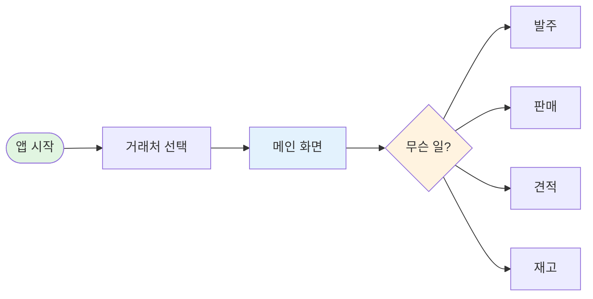
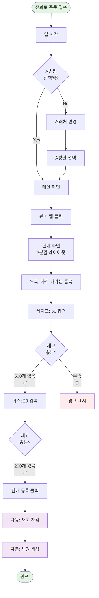
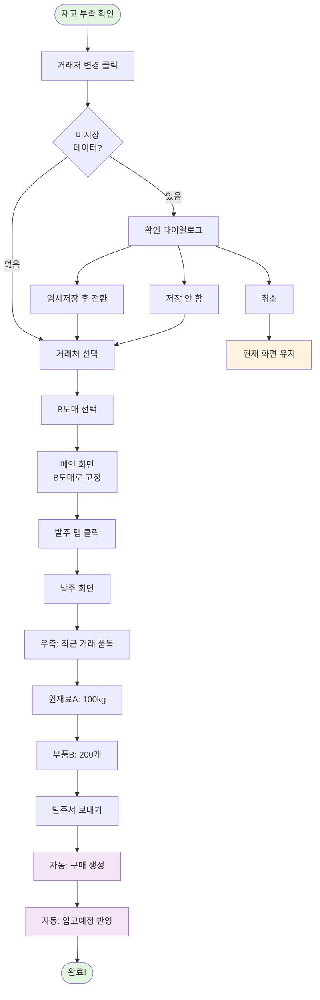
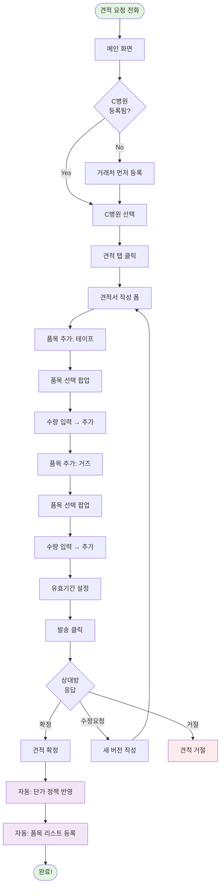
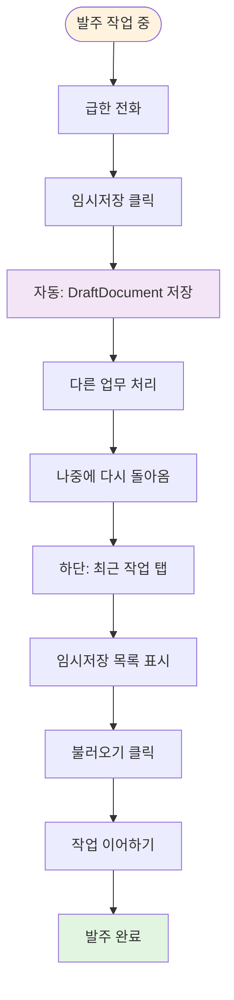

# 사용자 여정 (어떻게 사용하나요?)

> **작성일**: 2026년 1월 26일
> **목적**: 사용자가 앱을 어떻게 쓰는지 그림으로 이해하기
> **대상**: 기획자, 사업 담당자

---

## 🎯 전체 흐름 (한눈에 보기)



**간단 설명**:
1. 앱 시작 → 거래처 선택
2. 메인 화면 → 업무 선택
3. 발주/판매/견적/재고 등 작업

---

## 📱 시나리오 1: 병원에서 주문 받았을 때

### 상황
```
전화: "안녕하세요, A병원입니다.
       테이프 50개, 거즈 20개 주문합니다."
```

### 처리 과정



### 소요 시간
```
전화 받기      → 5초
거래처 확인    → 2초
판매 탭 열기   → 1초
수량 입력      → 10초 (테이프 + 거즈)
판매 등록      → 2초
───────────────────
합계: 20초
```

---

## 📦 시나리오 2: 도매에 발주할 때

### 상황
```
재고 확인 결과:
- 원재료A: 10kg 남음 (부족!)
- 부품B: 50개 남음 (부족!)
→ 추가 발주 필요
```

### 처리 과정



### 소요 시간
```
거래처 변경    → 3초
발주 탭 열기   → 1초
품목 수량 입력 → 15초
발주 확정      → 2초
───────────────────
합계: 21초
```

---

## 💡 시나리오 3: 견적서 작성

### 상황
```
신규 거래처 "C병원"에서
견적 요청 전화가 왔습니다.
```

### 처리 과정



### 견적 확정 시 자동 처리
```
1. 단가 정책 반영
   → 이 거래처에 대한 품목 단가 저장
   → 다음부터 자동 적용

2. 품목 리스트 등록
   → "자주 거래하는 품목"으로 등록
   → 다음 견적/판매 시 우측에 표시
```

---

## 🔄 시나리오 4: 임시저장 활용

### 상황
```
발주서 작성 중 급한 전화가 와서
작업을 중단해야 함
```

### 처리 과정



### 장점
```
✅ 언제든 작업 중단 가능
✅ 데이터 유실 방지
✅ 여러 발주서 동시 작성 가능
```

---

## 🎨 화면 전환 패턴

### 패턴 1: 탭 전환
```
메인 화면 내에서:
[발주] → [판매] → [재고]

┌────────────────────────┐
│ [발주][판매][재고]     │ ← 클릭하면 즉시 전환
├────────────────────────┤
│ (내용만 바뀜)          │
└────────────────────────┘
```
- 빠름 (즉시)
- 상단바 유지

---

### 패턴 2: 팝업 열기
```
발주/판매 화면에서:
[+ 품목 추가] 클릭

┌────────────────┐
│ 발주 화면      │
│   ┌──────────┐ │
│   │품목 선택 │ │ ← 팝업
│   └──────────┘ │
└────────────────┘
```
- 부모 화면 뒤로 Dim 처리
- [추가]/[취소] 후 팝업 닫힘

---

### 패턴 3: 거래처 전환
```
[거래처 변경] 클릭

A병원 → 확인 다이얼로그 → 거래처 선택 → B도매

전체 화면 리로드
(모든 데이터 B도매 기준으로 재조회)
```
- 느림 (데이터 재조회)
- 신중하게 사용

---

## 📊 사용 빈도 예상

### 매우 자주 (하루 50회 이상)
```
✨ 탭 전환 (발주 ↔ 판매)
✨ 품목 선택 팝업
✨ 수량 입력
```
→ **이 부분을 제일 빠르게 만들어야 함!**

---

### 자주 (하루 10~50회)
```
📋 임시저장/불러오기
📋 발주/판매 확정
📋 재고 조회
```

---

### 보통 (하루 2~10회)
```
🔄 거래처 전환
📝 견적서 작성
🔍 품목 검색
```

---

### 드물게 (하루 1~2회)
```
⚙️ 새 품목 등록
⚙️ 재고 조정
📊 채권 확인
```

---

## 🚀 사용성 목표

### 발주/판매 입력 속도
```
일반적인 경우:
- 자주 쓰는 품목 3개 입력
- 목표: 30초 이내

복잡한 경우:
- 새 품목 검색해서 10개 입력
- 목표: 2분 이내
```

### 거래처 전환 속도
```
- 거래처 선택 화면 로드
- 목표: 1초 이내

- 데이터 재조회
- 목표: 2초 이내
```

---

## 💬 사용자 피드백 반영 계획

### Phase 1 출시 후
```
1. 사용 로그 수집
   - 어느 기능을 가장 많이 쓰나?
   - 어디서 시간이 오래 걸리나?

2. 사용자 인터뷰
   - 불편한 점은?
   - 추가하고 싶은 기능은?

3. Phase 2 개선
   - 탭 기능 추가 (여러 거래처 동시 작업)
   - 단축키 지원
   - Excel 업로드 확대
```

---

**작성자**: John (기획팀)
**최종 수정**: 2026년 1월 26일
