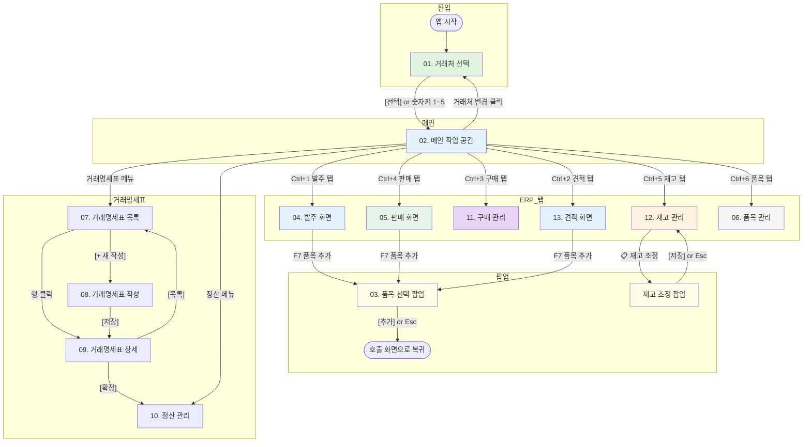
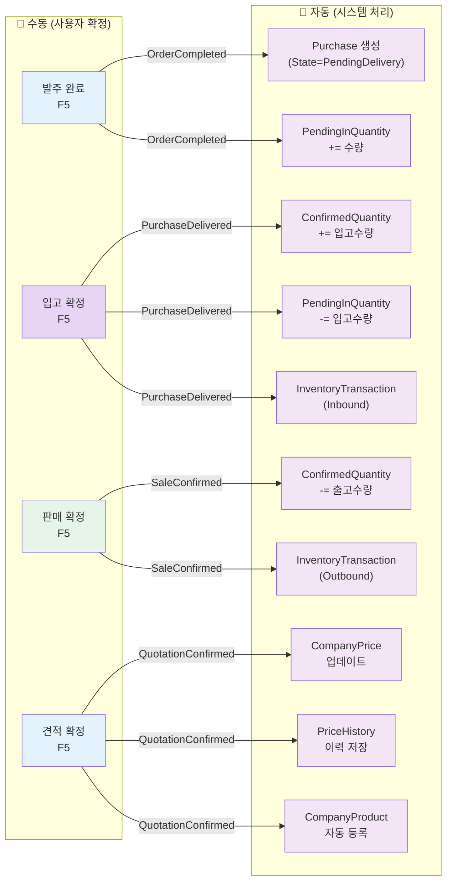
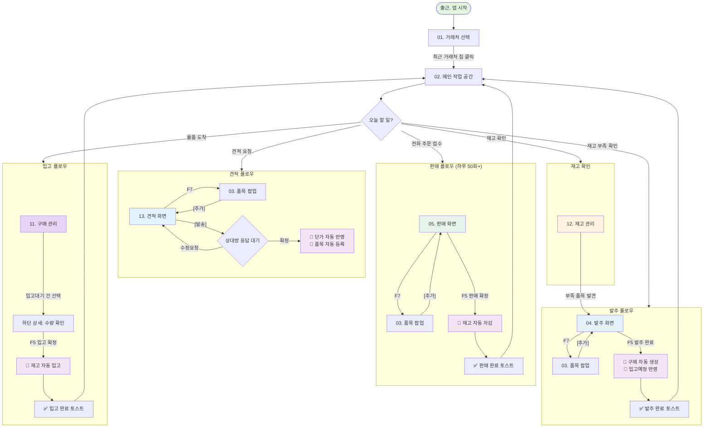

# 화면 전환 다이어그램 (자동화 포함)

> **작성일**: 2026-02-10
> **목적**: 전체 화면 간 전환 흐름 + MVP 자동화 트리거 포인트 시각화
> **대상**: 기획자, 개발자

---

## 1. 전체 화면 맵 (Overview)

```
┌─────────────────────────────────────────────────────────────────────┐
│                        Tran 화면 구조                                │
├─────────────────────────────────────────────────────────────────────┤
│                                                                      │
│  ┌──────────────────┐                                                │
│  │ 01. 거래처 선택    │ ← 앱 시작점                                   │
│  └────────┬─────────┘                                                │
│           │ [선택] / 숫자키 1~5                                       │
│           ▼                                                          │
│  ┌──────────────────────────────────────────────────────────────┐    │
│  │ 02. 메인 작업 공간 (탭 구조)                                   │    │
│  │                                                                │    │
│  │  ┌─────┐┌─────┐┌─────┐┌─────┐┌─────┐┌─────┐                  │    │
│  │  │발주¹││견적²││구매³││판매⁴││재고⁵││품목⁶│ ← Ctrl+1~6       │    │
│  │  └──┬──┘└──┬──┘└──┬──┘└──┬──┘└──┬──┘└──┬──┘                  │    │
│  │     │      │      │      │      │      │                      │    │
│  │     ▼      ▼      ▼      ▼      ▼      ▼                      │    │
│  │  ┌─────┐┌─────┐┌─────┐┌─────┐┌─────┐┌─────┐                  │    │
│  │  │ 04  ││ 13  ││ 11  ││ 05  ││ 12  ││ 06  │                  │    │
│  │  │발주 ││견적 ││구매 ││판매 ││재고 ││품목 │                  │    │
│  │  │화면 ││화면 ││관리 ││화면 ││관리 ││관리 │                  │    │
│  │  └─────┘└─────┘└─────┘└─────┘└─────┘└─────┘                  │    │
│  └──────────────────────────────────────────────────────────────┘    │
│                                                                      │
│  ┌──────────────────────────────────────────────────────────────┐    │
│  │ 공통 팝업                                                      │    │
│  │  ┌──────────────┐  ┌──────────────┐                            │    │
│  │  │ 03. 품목 선택  │  │ 재고 조정     │                            │    │
│  │  │     팝업       │  │   팝업        │                            │    │
│  │  └──────────────┘  └──────────────┘                            │    │
│  └──────────────────────────────────────────────────────────────┘    │
│                                                                      │
│  ┌──────────────────────────────────────────────────────────────┐    │
│  │ 거래명세표 시스템 (Phase 1 Core)                                │    │
│  │  ┌─────┐ ┌─────┐ ┌─────┐ ┌─────┐                              │    │
│  │  │ 07  │ │ 08  │ │ 09  │ │ 10  │                              │    │
│  │  │목록 │→│작성 │→│상세 │→│정산 │                              │    │
│  │  └─────┘ └─────┘ └─────┘ └─────┘                              │    │
│  └──────────────────────────────────────────────────────────────┘    │
└─────────────────────────────────────────────────────────────────────┘
```

---

## 2. 화면 전환 상세 (Mermaid)



---

## 3. 자동화 트리거 포인트

사용자가 **확정 버튼**을 누르는 순간 발동하는 자동화 흐름.



---

## 4. 화면 간 데이터 흐름 (자동 연쇄)

하나의 데이터 입력이 여러 화면에 자동 반영되는 흐름.

### 4.1 발주 → 구매 → 재고 (입고 플로우)

```
04. 발주 화면                11. 구매 관리               12. 재고 관리
┌─────────────────┐         ┌─────────────────┐         ┌─────────────────┐
│                  │         │                  │         │                  │
│ 발주서 작성      │         │ (자동 생성됨)     │         │ (자동 반영됨)     │
│ 품목: 테이프     │ ──🤖──▶ │ 테이프 100개     │         │ 테이프            │
│ 수량: 100개      │         │ 입고대기         │         │ 확정: 500개       │
│ 단가: ₩3,500    │         │                  │ ──🤖──▶ │ 입고예정: +100개  │
│                  │         │ 👤 입고 확정 시   │         │                  │
│ 👤 [발주 완료]   │         │ → 재고 자동 반영  │         │ (입고 후)          │
│                  │         │                  │         │ 확정: 600개       │
│                  │         │                  │         │ 입고예정: 0개     │
└─────────────────┘         └─────────────────┘         └─────────────────┘

시간축: ──────────────────────────────────────────────────────────────▶
        발주일                입고일(수일 후)            입고 확정 즉시
```

### 4.2 판매 → 재고 (출고 플로우)

```
05. 판매 화면                12. 재고 관리
┌─────────────────┐         ┌─────────────────┐
│                  │         │                  │
│ 판매 등록        │         │ (자동 반영됨)     │
│ 품목: 테이프     │ ──🤖──▶ │ 테이프            │
│ 수량: 50개       │         │ 확정: 500 → 450  │
│ 단가: ₩5,000    │         │                  │
│                  │         │ InventoryTx      │
│ 👤 [판매 확정]   │         │ Type: Outbound   │
│                  │         │ Qty: -50         │
└─────────────────┘         └─────────────────┘

시간축: ──────────────────────────────────────▶
        판매 확정 즉시        동시 반영
```

### 4.3 견적 → 단가/품목 반영 플로우

```
13. 견적 화면                04/05. 발주/판매 화면        03. 품목 선택 팝업
┌─────────────────┐         ┌─────────────────┐         ┌─────────────────┐
│                  │         │                  │         │                  │
│ 견적서 작성      │         │ (단가 자동 적용)  │         │ (자동 등록됨)     │
│ A병원 테이프     │ ──🤖──▶ │ A병원 선택 시     │ ──🤖──▶ │ "자주 거래 품목"  │
│ 단가: ₩5,000   │         │ 테이프 단가       │         │ 에 테이프 표시    │
│                  │         │ = ₩5,000 고정    │         │                  │
│ 👤 [견적 확정]   │         │                  │         │                  │
└─────────────────┘         └─────────────────┘         └─────────────────┘

시간축: ──────────────────────────────────────────────────────────────▶
        견적 확정             다음 발주/판매 시           다음 품목 추가 시
```

---

## 5. 전환 유형별 분류

### 5.1 탭 전환 (즉시, 0.1초 이내)

| 출발 | 도착 | 트리거 | 비고 |
|------|------|--------|------|
| 어느 탭이든 | 발주 | Ctrl+1 | 파란 액센트 바 |
| 어느 탭이든 | 견적 | Ctrl+2 | 파란 액센트 바 |
| 어느 탭이든 | 구매 | Ctrl+3 | 보라 액센트 바 |
| 어느 탭이든 | 판매 | Ctrl+4 | 초록 액센트 바 |
| 어느 탭이든 | 재고 | Ctrl+5 | 주황 액센트 바 |
| 어느 탭이든 | 품목 | Ctrl+6 | - |

**미저장 데이터 보호**: 탭 전환 시 미저장 데이터가 있으면 확인 다이얼로그 → 자동 임시저장(30초 주기)으로 데이터 유실 최소화.

### 5.2 팝업 호출 (오버레이, 부모 화면 유지)

| 출발 | 팝업 | 트리거 | 복귀 |
|------|------|--------|------|
| 발주/판매/견적 | 품목 선택 팝업 | F7 / [+ 품목 추가] | [추가] or Esc |
| 재고 관리 | 재고 조정 팝업 | [📋 재고 조정] | [저장] or Esc |

**팝업 규칙**:
- 부모 화면은 Dim 처리 (opacity 50%)
- 키보드 포커스는 팝업 내부에 트랩
- Esc 키로 취소 가능
- 팝업 외부 클릭 시 닫히지 않음 (데이터 유실 방지)

### 5.3 화면 전환 (네비게이션, 데이터 재조회)

| 출발 | 도착 | 트리거 | 소요시간 |
|------|------|--------|---------|
| 거래처 선택 | 메인 작업 공간 | [선택] 클릭 | < 1초 |
| 메인 작업 공간 | 거래처 선택 | [거래처 변경] | < 0.5초 |
| 메인 작업 공간 | 거래명세표 목록 | 메뉴 클릭 | < 0.5초 |
| 거래명세표 목록 | 거래명세표 상세 | 행 클릭 | < 0.5초 |

### 5.4 자동화 트리거 (확정 시 백그라운드)

| 확정 화면 | 이벤트 | 영향받는 화면 | 소요시간 |
|----------|--------|-------------|---------|
| 04. 발주 | OrderCompleted | 11. 구매, 12. 재고 | < 0.5초 |
| 11. 구매 | PurchaseDelivered | 12. 재고 | < 0.5초 |
| 05. 판매 | SaleConfirmed | 12. 재고 | < 0.5초 |
| 13. 견적 | QuotationConfirmed | 단가 DB, 품목 DB | < 0.5초 |

---

## 6. 거래처 전환 시 영향 범위

```
[거래처 변경] 클릭
    │
    ├─ 미저장 데이터 있으면 → 확인 다이얼로그
    │   ├─ [임시저장 후 전환] → DraftDocument 저장 → 진행
    │   ├─ [저장 안 함]       → 데이터 폐기 → 진행
    │   └─ [취소]             → 현재 화면 유지
    │
    ▼ (전환 진행)
    ┌──────────────────────────────────────────────┐
    │ 01. 거래처 선택 화면                            │
    │     사용자가 새 거래처 선택                      │
    └──────────────────────────┬───────────────────┘
                               │
                               ▼
    ┌──────────────────────────────────────────────┐
    │ 전체 컨텍스트 교체 (Full Reload)                │
    │                                                │
    │  - 상단바: 거래처명/타입 변경                    │
    │  - 발주 탭: 해당 거래처 발주 목록                │
    │  - 견적 탭: 해당 거래처 견적 목록                │
    │  - 구매 탭: 해당 거래처 구매 목록                │
    │  - 판매 탭: 해당 거래처 판매 목록                │
    │  - 재고 탭: 전체 재고 (거래처 무관)              │
    │  - 품목 탭: 전체 품목 (거래처 무관)              │
    │  - 우측 패널: "자주 거래 품목" 거래처별 재조회    │
    └──────────────────────────────────────────────┘
```

**주의**: 재고/품목은 거래처 무관 전역 데이터. 발주/견적/구매/판매는 거래처별 필터링.

---

## 7. 통합 사용자 여정 (전체 플로우)

### 7.1 일과 시작 ~ 종료



### 7.2 일반적인 하루 타임라인

```
09:00  앱 시작 → 거래처 선택 (A병원)
       │
09:05  📞 전화 주문 → 판매 탭 → 품목 입력 → [판매 확정]
       │                                      └→ 🤖 재고 차감
09:06  📞 전화 주문 → 판매 탭 → 품목 입력 → [판매 확정]
       │                                      └→ 🤖 재고 차감
       ... (반복 50회+)
       │
10:30  재고 탭 확인 → ⚠️ 테이프 부족 발견
       │
10:31  거래처 변경 → B도매 선택
       │
10:32  발주 탭 → 부족 품목 발주 → [발주 완료]
       │                           ├→ 🤖 구매 레코드 생성
       │                           └→ 🤖 입고예정 반영
       │
10:35  거래처 변경 → A병원 복귀 → 판매 계속
       │
14:00  📦 물품 도착 (B도매 발주분)
       │
14:01  거래처 변경 → B도매 선택
       │
14:02  구매 탭 → 입고대기 건 선택 → 수량 확인 → [입고 확정]
       │                                          ├→ 🤖 확정재고 증가
       │                                          └→ 🤖 입고예정 차감
       │
14:05  거래처 변경 → A병원 복귀 → 판매 계속
       │
16:00  📞 C병원 견적 요청
       │
16:01  거래처 변경 → C병원 선택
       │
16:05  견적 탭 → 견적서 작성 → [발송]
       │
17:00  퇴근
```

---

## 8. 키보드 네비게이션 맵

```
전역 단축키 (모든 화면에서)
────────────────────────────
Ctrl+1~6    탭 전환
Ctrl+F      검색 포커스
Esc         팝업 닫기 / 취소

작업 화면 단축키 (발주/판매/견적)
────────────────────────────
F5          확정 (발주완료 / 판매확정 / 입고확정)
F6          임시저장
F7          품목 추가 팝업 열기
Tab         다음 입력 필드
Shift+Tab   이전 입력 필드
Enter       현재 항목 추가/확인

품목 선택 팝업 (03)
────────────────────────────
Ctrl+F      검색 포커스
Space       체크박스 토글
↑↓          품목 탐색
Enter       선택 품목 수량 입력으로 이동
Esc         팝업 닫기

거래처 선택 (01)
────────────────────────────
1~5         최근 거래처 빠른 선택
Ctrl+F      검색 포커스
Enter       카드 선택
```

---

## 9. 화면 전환 매트릭스

각 화면에서 다른 화면으로의 전환 가능 여부.

| 출발 ╲ 도착 | 01거래처 | 02메인 | 03팝업 | 04발주 | 05판매 | 06품목 | 07목록 | 08작성 | 09상세 | 10정산 | 11구매 | 12재고 | 13견적 |
|-------------|---------|--------|--------|--------|--------|--------|--------|--------|--------|--------|--------|--------|--------|
| 01 거래처    | -       | ✅      | -      | -      | -      | -      | -      | -      | -      | -      | -      | -      | -      |
| 02 메인      | ✅       | -      | -      | 탭     | 탭     | 탭     | 메뉴   | -      | -      | 메뉴   | 탭     | 탭     | 탭     |
| 03 팝업      | -       | -      | -      | 복귀   | 복귀   | -      | -      | -      | -      | -      | -      | -      | 복귀   |
| 04 발주      | -       | -      | 팝업   | -      | 탭     | 탭     | -      | -      | -      | -      | 탭     | 탭     | 탭     |
| 05 판매      | -       | -      | 팝업   | 탭     | -      | 탭     | -      | -      | -      | -      | 탭     | 탭     | 탭     |
| 06 품목      | -       | -      | -      | 탭     | 탭     | -      | -      | -      | -      | -      | 탭     | 탭     | 탭     |
| 07 목록      | -       | ✅      | -      | -      | -      | -      | -      | ✅      | ✅      | -      | -      | -      | -      |
| 08 작성      | -       | -      | -      | -      | -      | -      | ✅      | -      | ✅      | -      | -      | -      | -      |
| 09 상세      | -       | -      | -      | -      | -      | -      | ✅      | -      | -      | ✅      | -      | -      | -      |
| 10 정산      | -       | ✅      | -      | -      | -      | -      | -      | -      | ✅      | -      | -      | -      | -      |
| 11 구매      | -       | -      | -      | 탭     | 탭     | 탭     | -      | -      | -      | -      | -      | 탭     | 탭     |
| 12 재고      | -       | -      | -      | 탭     | 탭     | 탭     | -      | -      | -      | -      | 탭     | -      | 탭     |
| 13 견적      | -       | -      | 팝업   | 탭     | 탭     | 탭     | -      | -      | -      | -      | 탭     | 탭     | -      |

**범례**: 탭=탭 전환, 팝업=오버레이 팝업, 복귀=팝업 닫기, 메뉴=네비게이션 메뉴, ✅=직접 이동

---

## 10. 에러/예외 시 화면 전환

### 10.1 자동화 실패 시

```
👤 [판매 확정] 클릭
    │
    ├─ 🤖 재고 차감 시도
    │   ├─ 성공 → ✅ 토스트 "판매 완료, 재고 -50"
    │   └─ 실패 → ⚠️ 토스트 "판매 완료, 재고 반영 실패 (수동 확인 필요)"
    │              └→ 판매 자체는 완료됨 (트랜잭션 분리)
    │              └→ 재고 화면에 ⚠️ 미반영 건 표시
    │
    └─ 화면은 현재 탭 유지 (강제 전환 없음)
```

### 10.2 네트워크 오류 시

```
모든 화면 상단:
┌──────────────────────────────────────────────┐
│ ⚠️ 동기화 실패: 로컬 데이터로 작업 중입니다.    │
└──────────────────────────────────────────────┘

- 화면 전환에 영향 없음 (로컬 DB 기반)
- 모든 작업 가능, 나중에 동기화
```

---

## 11. 성능 목표 요약

| 전환 유형 | 목표 시간 | 비고 |
|----------|----------|------|
| 탭 전환 | < 0.1초 | 데이터 캐시됨 |
| 팝업 열기/닫기 | < 0.2초 | 오버레이 |
| 거래처 전환 | < 2초 | 전체 데이터 재조회 |
| 자동화 처리 | < 0.5초 | 백그라운드 |
| 거래처 선택 화면 로드 | < 0.5초 | 앱 시작 |
| 토스트 알림 표시 | 즉시 | 3초 후 자동 소멸 |

---

## 관련 문서

- [사용자-여정.md](./사용자-여정.md) - 시나리오별 사용자 여정
- [../와이어프레임/README.md](../와이어프레임/README.md) - 와이어프레임 전체 목록
- [../자동화-경계-정의서.md](../자동화-경계-정의서.md) - 자동/수동 경계 정의
- [../../통합-아키텍처.md](../../통합-아키텍처.md) - 시스템 아키텍처

---

**작성자**: Claude (AI Assistant)
**작성일**: 2026-02-10
**버전**: 1.0
