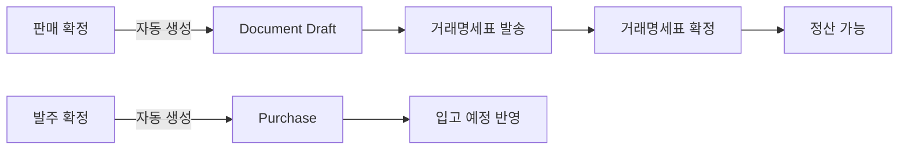

# 📐 와이어프레임 (Wireframes)

> **대상**: 기획자, 디자이너, 개발자
> **목적**: Phase 1 MVP 화면 설계 (10개 P0 화면)

---

## 📚 와이어프레임 목록

### ERP 기능 (6개)

| No | 파일명 | 화면 | 우선순위 |
|----|--------|------|---------|
| 01 | [01-거래처-선택-화면.md](./01-거래처-선택-화면.md) | 거래처 선택 화면 | P0 |
| 02 | [02-메인-작업-공간.md](./02-메인-작업-공간.md) | 메인 작업 공간 (통합 허브) | P0 |
| 03 | [03-품목-선택-팝업.md](./03-품목-선택-팝업.md) | 품목 선택 팝업 (공통) | P0 |
| 04 | [04-발주-화면.md](./04-발주-화면.md) | 발주 화면 (3분할) | P0 |
| 05 | [05-판매-화면.md](./05-판매-화면.md) | 판매 화면 (3분할) | P0 |
| 06 | [06-품목-관리-화면.md](./06-품목-관리-화면.md) | 품목 관리 화면 | P0 |

### MVP 자동화 화면 (3개) — NEW

| No | 파일명 | 화면 | 우선순위 |
|----|--------|------|---------|
| 11 | [11-구매-관리-화면.md](./11-구매-관리-화면.md) | 구매 관리 (마스터-디테일) | P2 |
| 12 | [12-재고-관리-화면.md](./12-재고-관리-화면.md) | 재고 관리 (테이블+이력) | P1 |
| 13 | [13-견적-화면.md](./13-견적-화면.md) | 견적 화면 (2분할+미리보기) | P1 |

### 키보드 워크플로 — NEW

| No | 파일명 | 화면 | 우선순위 |
|----|--------|------|---------|
| 00 | [00-키보드-단축키.md](./00-키보드-단축키.md) | 전 화면 키보드 단축키 | 공통 |

### 거래명세표 시스템 (4개)

| No | 파일명 | 화면 | 우선순위 |
|----|--------|------|---------|
| 07 | [07-거래명세표-목록.md](./07-거래명세표-목록.md) | 거래명세표 목록 | P0 |
| 08 | [08-거래명세표-작성.md](./08-거래명세표-작성.md) | 거래명세표 작성 | P0 |
| 09 | [09-거래명세표-상세.md](./09-거래명세표-상세.md) | 거래명세표 상세 + 상태 전환 | P0 |
| 10 | [10-정산-관리.md](./10-정산-관리.md) | 정산 관리 | P0 |

---

## 🎯 화면 흐름 (User Flow)

### 앱 시작 → 판매
```
01. 거래처 선택
    ↓
02. 메인 작업 공간
    ↓
    [판매] 탭 클릭
    ↓
05. 판매 화면
    ├─ 03. 품목 선택 팝업 (+ 품목 추가 시)
    └─ [판매 확정]
       ↓
       자동: Document 생성
       ↓
07. 거래명세표 목록
    ↓
09. 거래명세표 상세
    └─ [발송] → [확정]
       ↓
10. 정산 관리
```

### 앱 시작 → 발주
```
01. 거래처 선택
    ↓
02. 메인 작업 공간
    ↓
    [발주] 탭 클릭
    ↓
04. 발주 화면
    ├─ 03. 품목 선택 팝업 (+ 품목 추가 시)
    └─ [발주 확정]
       ↓
       자동: Purchase 생성, 입고 예정 반영
```

### 품목 관리
```
02. 메인 작업 공간
    ↓
    [품목] 탭 클릭
    ↓
06. 품목 관리 화면
    └─ [+ 품목 등록] or [편집]
```

---

## 🔗 통합 아키텍처 (ERP + 거래명세표)

### 핵심 연결점



**자동 연계**:
1. **판매 확정** → Document 자동 생성 (state=Draft)
2. **Document 확정** → 정산 가능 (증거 효력)
3. **발주 확정** → Purchase 생성 → 입고 예정 반영

---

## 📋 각 와이어프레임 포함 내용

각 문서는 다음을 포함합니다:

### 1. 전체 레이아웃 (ASCII 아트)
```
┌─────────────────────────┐
│ 화면 구조 시각화        │
│                         │
│ [버튼]  [입력]          │
└─────────────────────────┘
```

### 2. 화면 구성 요소
- 헤더, 본문, 하단 버튼
- 각 요소의 크기, 색상, 폰트
- 배치 위치

### 3. 상호작용 흐름
- 시나리오별 사용자 동작
- 시스템 응답
- 다음 화면 전환

### 4. 데이터 요구사항
- 필요한 DB 쿼리
- 데이터 처리 로직
- 유효성 검증

### 5. 예외 상황
- 에러 메시지
- 경고 다이얼로그
- 엣지 케이스 처리

### 6. 개발 참고사항
- ViewModel 구조
- XAML 컨트롤
- 코드 스니펫

---

## 🎨 공통 디자인 원칙

### 1. 색상 코드 (일관성)

#### 상태 배지 (거래명세표)
| 상태 | 배지 배경 | 배지 텍스트 |
|------|-----------|------------|
| 작성중 | `#F0F0F0` | `#555555` |
| 발송 | `#E8F1FF` | `#1E5EFF` |
| 수신 | `#FFF4E5` | `#E67700` |
| 확정 | `#E6F4EA` | `#1E7F34` |

#### 버튼 색상
| 용도 | 배경색 | 텍스트 색 |
|------|--------|----------|
| 주요 동작 (확정, 저장) | `#1E90FF` | `#FFFFFF` |
| 긍정 동작 (추가, 판매) | `#27AE60` | `#FFFFFF` |
| 보조 동작 (임시저장) | `#95A5A6` | `#FFFFFF` |
| 위험 동작 (삭제) | `#E74C3C` | `#FFFFFF` |

#### 금액 표시
| 종류 | 색상 | 예시 |
|------|------|------|
| 미수금 (받을 돈) | `#E74C3C` | ₩850,000 |
| 미지급 (줄 돈) | `#3498DB` | ₩1,200,000 |
| 일반 금액 | `#1E90FF` | ₩350,000 |

#### 재고 상태 (색상 + 아이콘 병행) — WCAG 1.4.1
| 상태 | 색상 | 아이콘 | 텍스트 |
|------|------|--------|--------|
| 정상 | `#27AE60` (초록) | ✅ | "{수량}" |
| 안전재고 미만 | `#FFA500` (주황) | ⚠️ | "{수량} (부족)" |
| 품절 | `#E74C3C` (빨강) | ❌ | "0 (품절)" |

> **접근성 원칙**: 색상만으로 정보를 전달하지 않는다. 모든 색상 구분에 아이콘/텍스트를 병행한다.

#### 화면별 액센트 바 (시각 구분)
| 화면 | 액센트 바 색상 | 두께 |
|------|---------------|------|
| 발주 | `#1E90FF` (파란) | 상단 3px |
| 판매 | `#27AE60` (초록) | 상단 3px |
| 구매 | `#9B59B6` (보라) | 상단 3px |
| 재고 | `#F39C12` (주황) | 상단 3px |

### 2. 폰트 크기
- 제목 (헤더): 20px, 굵게
- 부제목: 16px, 굵게
- 본문: 14px, 보통
- 보조 텍스트: 12px, 회색
- 합계 금액: 18px, 굵게

### 3. 레이아웃
- 여백: 15~20px
- 버튼 높이: 32~36px
- 입력 필드 높이: 32px
- 테이블 행 높이: 35~40px

---

## 🔄 3분할 레이아웃 (발주/판매 공통)

```
┌────────────────────────┬────────────────────────┐
│ 좌: 전체 품목 (60%)    │ 우: 최근 거래 품목 (40%)│ ← 상단 50%
├═══════════════════════ ↕ GridSplitter ══════════┤
│ 하: 3탭 (등록/임시/이력)                         │ ← 하단 50%
└─────────────────────────────────────────────────┘
```

**특징**:
- 좌측: 검색 + 전체 품목 리스트 (**가상 스크롤**)
- 우측: 빠른 입력 (자주 쓰는 품목, **스크롤 가능**)
- 하단: 3탭 구조 (등록, 최근 작업, 이력)
- **GridSplitter**: 상하 비율을 드래그로 조절 가능
- **시각 구분**: 발주=파란색 액센트 바, 판매=초록색 액센트 바
- **자동 임시저장**: 30초마다

---

## 🚀 개발 순서 권장

### Week 1: 기본 흐름 (MVP)
```
Day 1: 01 → 02 (거래처 선택 + 메인 화면)
Day 2: 06 → 03 (품목 관리 + 품목 팝업)
Day 3: 04 (발주 화면 - 3분할)
Day 4: 05 (판매 화면 - 3분할)
Day 5: 통합 테스트 + 버그 수정
```

### Week 2: 거래명세표 통합
```
Day 1: 07 → 08 (거래명세표 목록 + 작성)
Day 2: 09 (거래명세표 상세 + 상태 기계)
Day 3: Sale → Document 자동 생성 연동
Day 4: 10 (정산 관리)
Day 5: 통합 테스트 + 버그 수정
```

---

## 📌 중요 체크리스트

### 개발 시작 전 확인
- [ ] 10개 와이어프레임 모두 검토 완료
- [ ] 통합 아키텍처 이해 (`docs/통합-아키텍처.md` 참고)
- [ ] 상태 기계 이해 (Draft → Sent → Received → Confirmed)
- [ ] ContentHash 개념 이해 (변조 방지)

### 개발 중 확인
- [ ] 색상 코드 일관성 유지
- [ ] 상태별 UI 색상 준수
- [ ] 재고 확인 로직 (판매 시 필수)
- [ ] Sale/Purchase → Document 자동 생성

### 개발 완료 후 확인
- [ ] 모든 화면 구현 완료
- [ ] 상태 전환 정상 동작
- [ ] 해시 검증 정상 동작
- [ ] 정산 화면에서 확정 문서만 표시

---

## 💡 사용 팁

### 기획자용
1. 각 와이어프레임을 순서대로 읽으세요
2. "상호작용 흐름" 섹션에 주목하세요
3. "예외 상황"을 놓치지 마세요

### 디자이너용
1. "화면 구성 요소" 섹션 참고
2. 색상 코드 일관성 유지
3. ASCII 아트를 실제 목업으로 변환

### 개발자용
1. "데이터 요구사항" 섹션 먼저 확인
2. "개발 참고사항"의 ViewModel/코드 참고
3. "통합 아키텍처" 이해 필수

---

## 🔗 관련 문서

### 기획 문서
- [../README.md](../README.md) - 기획 폴더 가이드
- [../00-현재-진행상황.md](../00-현재-진행상황.md) - 전체 진행 상황
- [../01-화면-목록.md](../01-화면-목록.md) - 19개 화면 전체 목록
- [../SUMMARY.md](../SUMMARY.md) - 경영진용 요약 보고서
- [../다이어그램/사용자-여정.md](../다이어그램/사용자-여정.md) - 사용자 여정
- [../다이어그램/화면-전환-다이어그램.md](../다이어그램/화면-전환-다이어그램.md) - 화면 전환 + 자동화 플로우

### 통합 아키텍처
- [../../통합-아키텍처.md](../../통합-아키텍처.md) - ERP + 거래명세표 통합

### 기술 문서
- `../../ui-ux-design/` - 개발자용 UI/UX 명세
- `../../features/` - 기능 상세 명세
- `../../prd.md` - 제품 요구사항 문서

---

## 📞 문의

**기획**: John (PM)
**작성일**: 2026-01-26
**버전**: 1.0

---

## ✅ 체크리스트

### 와이어프레임 완성도
- [x] 10개 P0 화면 모두 작성 완료
- [x] ASCII 아트 레이아웃 포함
- [x] 상호작용 흐름 정의
- [x] 데이터 요구사항 명시
- [x] 예외 상황 처리 정의
- [x] 개발 참고사항 포함

### 다음 단계
- [ ] 디자이너 검토 (목업 제작)
- [ ] 개발팀 검토 (기술 검토)
- [ ] 경영진 승인
- [ ] 개발 시작

---

**🎉 Phase 1 와이어프레임 완성!**

이제 개발을 시작할 준비가 되었습니다.
