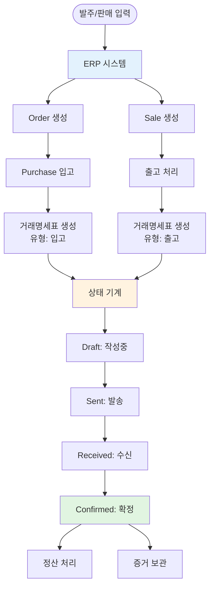
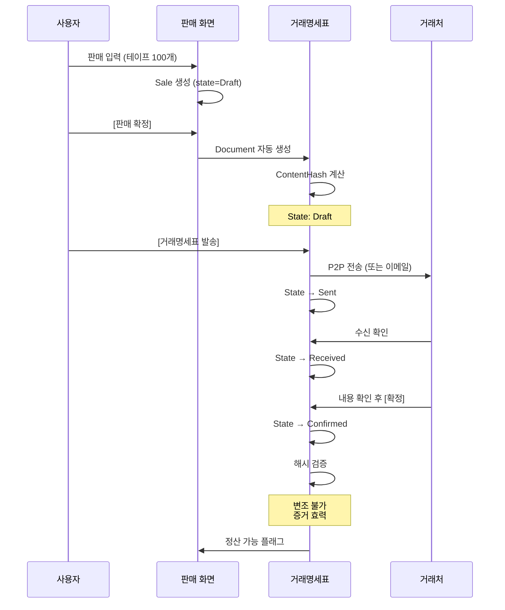
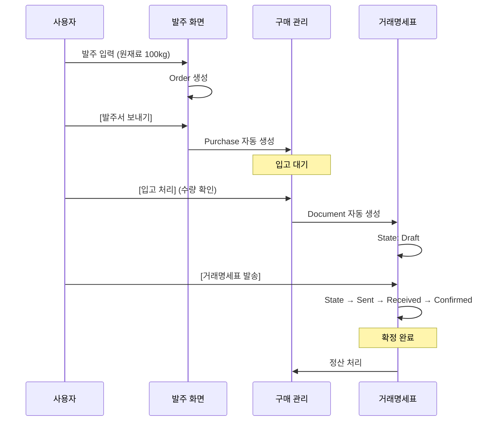

# Tran 통합 시스템 아키텍처

> **작성일**: 2026-01-26
> **목적**: ERP 기능 + 거래명세표 확정 시스템 통합
> **상태**: 설계 단계

---

## 🎯 통합 비전

### 한 줄 요약
**의료기기 유통 ERP + B2B 거래명세표 확정 시스템**

### 핵심 개념
```
Tran = 발주/판매/재고 관리 (ERP)
       +
       거래명세표 확정 (분쟁 방지)
```

---

## 🔗 두 시스템의 연결점

### ERP → 거래명세표 흐름



---

## 📊 통합 데이터 모델

### 기존 엔티티 (거래명세표 시스템)

```csharp
// 기존 Document 엔티티 유지
public class Document
{
    public int Id { get; set; }
    public string DocumentNumber { get; set; }

    // 상태 기계
    public DocumentState State { get; set; }

    // 해시 무결성
    public string ContentHash { get; set; }

    // 양측 회사
    public int FromCompanyId { get; set; }
    public int ToCompanyId { get; set; }

    // 품목
    public List<DocumentItem> Items { get; set; }

    // 이력
    public List<DocumentStateLog> StateLogs { get; set; }
}
```

### 신규 ERP 엔티티

```csharp
// 발주 (사는 것)
public class Order
{
    public int Id { get; set; }
    public string OrderNumber { get; set; }

    // 거래명세표 연결 ★
    public int? DocumentId { get; set; }
    public Document Document { get; set; }

    public OrderState State { get; set; }
    public List<OrderItem> Items { get; set; }
}

// 판매 (파는 것)
public class Sale
{
    public int Id { get; set; }
    public string SaleNumber { get; set; }

    // 거래명세표 연결 ★
    public int? DocumentId { get; set; }
    public Document Document { get; set; }

    public SaleState State { get; set; }
    public List<SaleItem> Items { get; set; }
}

// 재고
public class Inventory
{
    public int Id { get; set; }
    public int ProductId { get; set; }
    public int ConfirmedQuantity { get; set; }
    public int PendingInQuantity { get; set; }
    public int PendingOutQuantity { get; set; }
}

// 품목 마스터
public class Product
{
    public int Id { get; set; }
    public string Code { get; set; }
    public string Name { get; set; }
    public ProductTransactionType TransactionType { get; set; }
}
```

---

## 🔄 통합 워크플로우

### 시나리오 1: 판매 → 거래명세표 확정



**핵심 포인트**:
1. 판매 완료 → 거래명세표 자동 생성
2. 거래명세표 확정 → 정산 가능
3. 확정된 문서는 변조 불가 (해시)

---

### 시나리오 2: 발주 → 입고 → 거래명세표



---

## 🏗️ UI 통합

### Phase 1 화면 구조 (수정)

```
Tran 앱
│
├── 거래처 선택 화면 (공통)
│
├── MainWorkspace
│   ├── [발주] ← ERP 기능
│   ├── [견적] ← ERP 기능
│   ├── [구매] ← ERP 기능
│   ├── [판매] ← ERP 기능
│   ├── [재고] ← ERP 기능
│   ├── [품목] ← ERP 기능
│   │
│   ├── [거래명세표] ← 기존 시스템 ★
│   ├── [정산] ← 기존 시스템 ★
│   └── [이력] ← 기존 시스템 ★
```

**탭 추가**:
- **[거래명세표]**: Document 목록 (기존 MainWindow)
- **[정산]**: 확정된 문서 기준 정산
- **[이력]**: DocumentStateLog 조회

---

### 판매 화면 → 거래명세표 연동

```
┌─────────────────────────────────────────┐
│ 판매 등록                 [판매 확정]   │
├─────────────────────────────────────────┤
│ 품목: 테이프 100개                      │
│ 금액: ₩350,000                          │
│                                         │
│ [판매 확정] 클릭                        │
│         ↓                               │
│ Sale 생성 (state=Confirmed)             │
│         ↓                               │
│ Document 자동 생성 (state=Draft)        │
│         ↓                               │
│ ┌─────────────────────────────────────┐ │
│ │ 📄 거래명세표 생성됨                 │ │
│ │                                     │ │
│ │ Doc-20250126-001                    │ │
│ │ A병원 → 우리회사                    │ │
│ │ 품목: 테이프 100개                  │ │
│ │ 금액: ₩350,000                      │ │
│ │                                     │ │
│ │ [거래명세표 화면에서 보기]          │ │
│ │ [지금 발송하기]                     │ │
│ └─────────────────────────────────────┘ │
└─────────────────────────────────────────┘
```

---

## 📋 통합된 화면 목록 (Phase 1)

### P0 (최우선 - 10개)

#### ERP 기능 (6개)
1. 거래처 선택 화면
2. 메인 작업 공간
3. 품목 선택 팝업
4. 발주 화면
5. 판매 화면
6. 품목 관리 화면

#### 거래명세표 시스템 (4개) ★ 추가
7. **거래명세표 목록** (기존 MainWindow)
8. **거래명세표 작성** (기존 CreateDocumentWindow)
9. **거래명세표 상세** (기존 DocumentDetailWindow)
10. **정산 관리** (기존 SettlementManagementWindow)

---

## 🔐 핵심 원칙

### 1. 분리의 원칙
```
ERP 데이터: 수정 가능
- Order, Sale, Inventory
- 임시저장, 수정, 삭제 자유

거래명세표: 확정 후 불변
- Document (state=Confirmed)
- 해시 검증
- 변조 불가
```

### 2. 연결의 원칙
```
Sale/Purchase → Document 생성 (자동)
Document 확정 → Settlement 가능
Settlement → 회계 처리
```

### 3. 독립의 원칙
```
ERP 없이 거래명세표만 사용 가능
거래명세표 없이 ERP만 사용 가능
→ 하지만 함께 쓰면 강력함
```

---

## 🎨 상태 기계 통합

### ERP 상태
```
Order: Requested → Approved → Completed
Sale: Scheduled → Confirmed → Settled
Purchase: Created → Delivered → Inspected
```

### 거래명세표 상태 (기존 유지)
```
Document: Draft → Sent → Received → Confirmed
          ↓
     RevisionRequested → (new version)
```

**연결점**:
```
Sale.Confirmed → Document.Draft 생성
Document.Confirmed → Settlement 가능
```

---

## 📊 데이터베이스 마이그레이션

### 추가 테이블
```sql
-- ERP 테이블 추가
CREATE TABLE Orders (...);
CREATE TABLE OrderItems (...);
CREATE TABLE Sales (...);
CREATE TABLE SaleItems (...);
CREATE TABLE Purchases (...);
CREATE TABLE PurchaseItems (...);
CREATE TABLE Products (...);
CREATE TABLE Inventory (...);
CREATE TABLE CompanyPrices (...);
CREATE TABLE Quotations (...);

-- 기존 테이블 유지
Documents (기존)
DocumentItems (기존)
Companies (기존)
DocumentStateLogs (기존)
Settlements (기존)
```

### 연결 컬럼 추가
```sql
ALTER TABLE Documents ADD SaleId INT NULL;
ALTER TABLE Documents ADD PurchaseId INT NULL;
ALTER TABLE Documents ADD DocumentType VARCHAR(20); -- 'Sale' or 'Purchase'
```

---

## 🚀 구현 순서

### Week 1: ERP 기초 (P0 - ERP 부분)
```
Day 1: 거래처 선택 + 메인 화면
Day 2: 품목 관리 + 품목 팝업
Day 3: 3분할 레이아웃
Day 4: 발주 화면
Day 5: 판매 화면
```

### Week 2: 거래명세표 통합
```
Day 1: Sale/Purchase → Document 연동
Day 2: Document 상태 기계 (기존 로직 재사용)
Day 3: 거래명세표 발송 기능
Day 4: 정산 화면 업데이트
Day 5: 통합 테스트
```

### Week 3: 고급 기능
```
Day 1-2: 견적서 → 거래명세표 연동
Day 3: 재고 관리 완성
Day 4: 양식 관리 (기존 Template)
Day 5: 통합 테스트 + 버그 수정
```

---

## 💡 사용자 시나리오 (통합)

### 시나리오 1: 판매 완료 → 정산

```
1. [판매] 탭에서 판매 입력
   ↓
2. [판매 확정]
   ↓
3. 거래명세표 자동 생성 (알림)
   ↓
4. [거래명세표] 탭 이동
   ↓
5. 내용 확인 후 [발송]
   ↓
6. 거래처가 [확정]
   ↓
7. [정산] 탭에서 정산 처리
   ↓
8. 완료! (증거 영구 보관)
```

---

## 🔧 기술 스택 (변경 없음)

```
Frontend: WPF (기존)
Backend: C# .NET 8.0 (기존)
Database: SQLite (기존)
Pattern: MVVM (기존)
```

---

## 📌 마이그레이션 전략

### 기존 코드 활용
```
✅ Document 엔티티 (100% 재사용)
✅ StateTransitionService (100% 재사용)
✅ Hash 계산 로직 (100% 재사용)
✅ DocumentDetailWindow (수정 없이 사용)
✅ SettlementManagementWindow (확장만)
```

### 신규 코드
```
🆕 Order/Sale/Purchase 엔티티
🆕 Inventory 시스템
🆕 Product 마스터
🆕 ERP 화면들 (발주/판매/재고)
```

---

## 📖 문서 정리 계획

### 1. PRD 업데이트
```
_bmad-output/planning-artifacts/prd.md
→ 통합 시스템으로 재작성
```

### 2. Features 보완
```
docs/features/
├── 00-common-ux.md (유지)
├── 01-document-management.md (유지 + 확장)
├── 02-order-management.md (유지)
├── 03-inventory-finance.md (유지)
├── 05-product-master.md (유지)
└── 06-document-confirmation.md (신규 - 거래명세표 확정 프로세스)
```

### 3. 기획 문서 업데이트
```
docs/기획/
└── 통합-시나리오.md (신규)
```

---

## ✅ 통합 체크리스트

### 설계 단계 (진행 중)
- [x] 통합 아키텍처 정의
- [ ] 데이터 모델 통합
- [ ] UI 플로우 통합
- [ ] PRD 업데이트
- [ ] 와이어프레임 (통합 버전)

### 개발 단계 (예정)
- [ ] ERP 엔티티 추가
- [ ] Sale/Purchase → Document 연동
- [ ] 화면 통합
- [ ] 테스트

---

**작성자**: John (PM)
**버전**: 1.0
**최종 수정**: 2026-01-26
